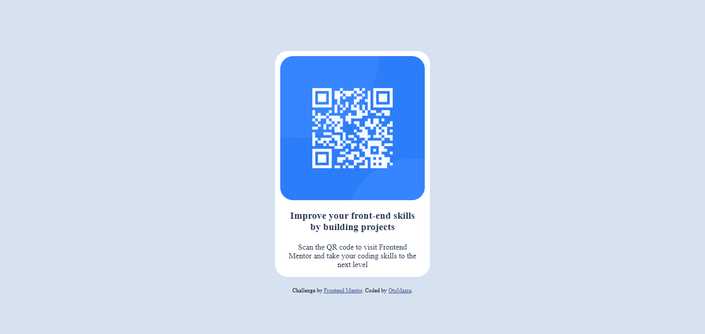

# Frontend Mentor - QR code component solution

This is a solution to the [QR code component challenge on Frontend Mentor](https://www.frontendmentor.io/challenges/qr-code-component-iux_sIO_H). Frontend Mentor challenges help you improve your coding skills by building realistic projects. 

## Table of contents

- [Overview](#overview)
  - [Screenshot](#screenshot)
  - [Links](#links)
  - [Built with](#built-with)
- [Author](#author)
## Overview

This is a Qr code web page where you can scan qr code by your phone and enter the frontendmentor.io website.

### Screenshot

### Links

- Solution URL: [Add solution URL here](https://otomazra.github.io/QR-code)

### Built with

- Semantic HTML5 markup
- CSS custom properties
- Flexbox

### What I learned

I trained my css flexbox skills.

## Author

- Website - [Add your name here](https://otomazra.github.io/personal-website-bootstrap)
- Frontend Mentor - [@yourusername](https://www.frontendmentor.io/profile/otomazra)

